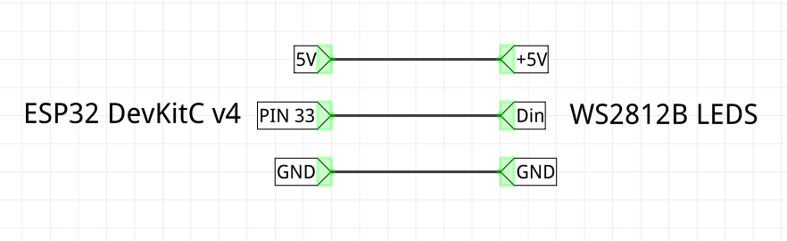

# Color chainging night light

Taken from [thingiverse](https://www.thingiverse.com/thing:5220507)

[TOC]

## Hardware

* WS2812B led strip (5V)
* ESP32 DevKitC v4

### Wiring



## Software

To be able to compile and upload software using `DOIT ESP32 DEVKIT V1` board.

Remember to set the appropiate number of leds in the sketch.

### Install ESP32 support for Arduino IDE

Source [link](https://randomnerdtutorials.com/installing-esp32-arduino-ide-2-0/)

Go to `File > Preferences` and add the following to `Additional Boards Manager URLs` (several urls can be separated by commas):

```plain
https://dl.espressif.com/dl/package_esp32_index.json
```

Open `Tools > Board > Boards Manager` and search and install:

* espP32 by Espressif Systems (1.0.6 on 18/02/2023).

Also install the following packages:

```bash
sudo apt install python3-serial python-is-python3
```

Finally, in the Arduino libraries install:

* FastLED by Daniel Garcia (3.5.0 on 18/02/2023)
