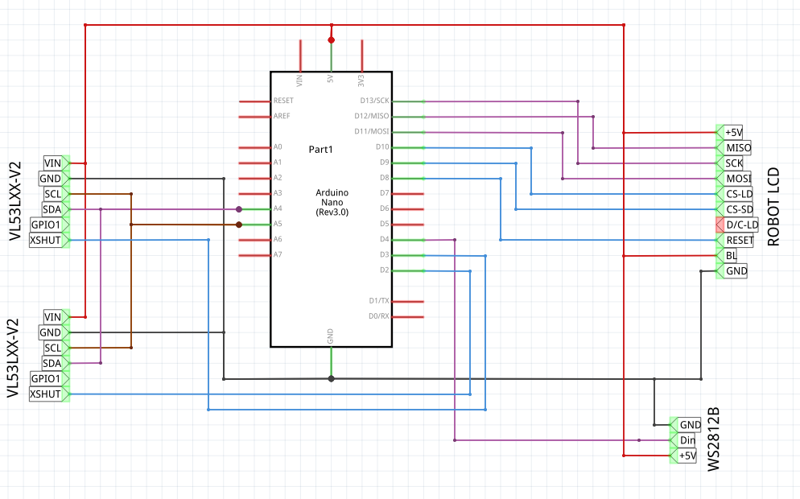

# Drone ring

[TOC]

## Materials

We started to develop with acoustic range sensors, but readings seemed to slow to be able to detect a drone and we moved to TOF sensors:

* Arduino Nano (rev 3.0)
* 2x VL53LXX-V2 (using "Adafruit_VL53L0X" library)
* Robot LCD (160x128 pixels)
* Addressable leds

## Schematic



## Support

### Change address of VL53LXX-V2

Address change is temporary until power down.

* Use XSHUT at LOW to set all sensors but one at reset.
* Change address of single sensor with:

    ```cpp
    Adafruit_VL53L0X lox = Adafruit_VL53L0X();
    const uint8_t DefaultAddress = VL53L0X_I2C_ADDR;

    void setup() {
        lox.begin(DefaultAddress + 1);
    }
    ```

* Repeat for all necessary sensors.

### Node MCU v3 (arduino support)

Used in earlier tests, but not compatible with ROBOT LCD.

* Add into Additional Boards URLs this [link](http://arduino.esp8266.com/stable/package_esp8266com_index.json)
* Search and install `ESP8266` boards.
* Use target `NodeMCU 1.0 (ESP-12E Module)`
