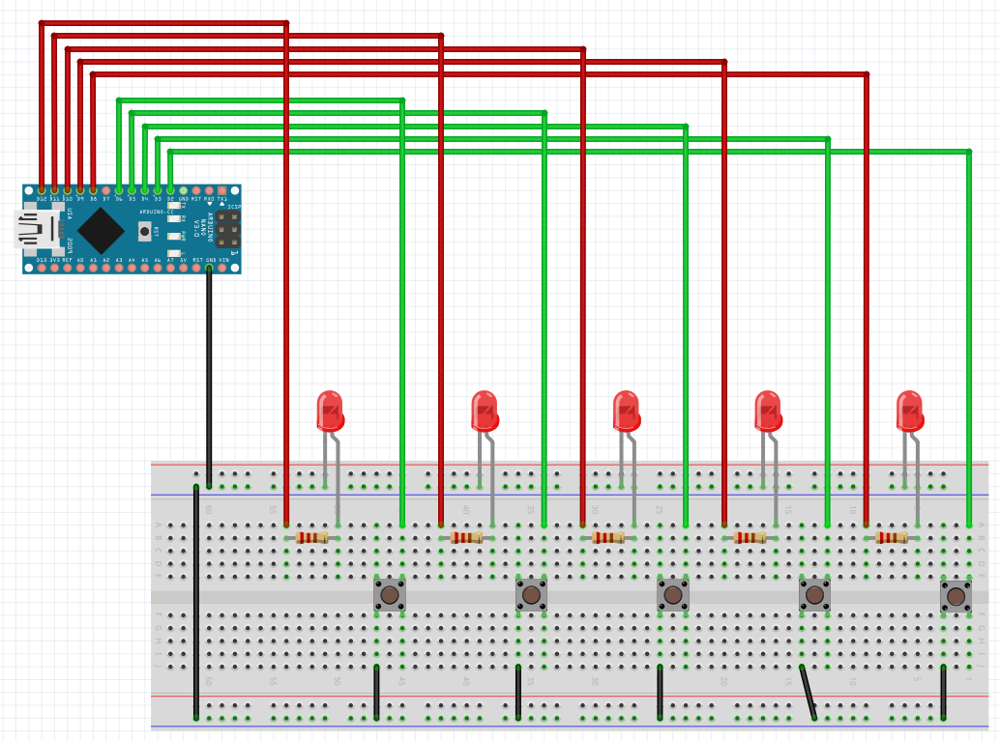
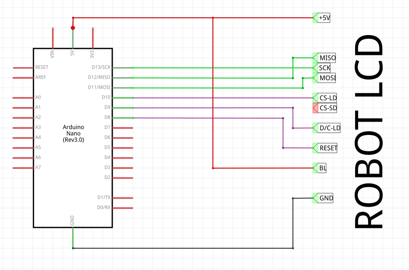

# Fast reaction led button pushing

[TOC]

## Prototype [v0]

* Arduino Nano v3 (old bootloader)
* 5x push buttons
* 5x red leds
* 5x 200 ohms resistor

## Screen prototype [v1]

* Arduino Nano v3 (old bootloader)
* Robot lcd

Software:

* Arduino TFT library

