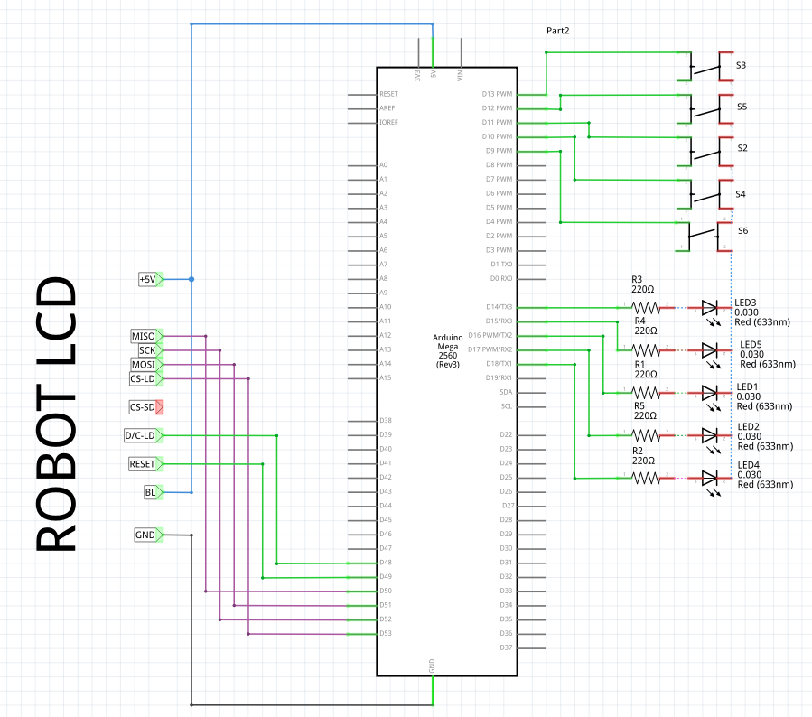

# Fast reaction led button pushing

[TOC]

## Prototype [v0]

* Arduino Nano v3 (old bootloader)
* 5x push buttons
* 5x red leds
* 5x 220 ohms resistor


## Screen prototype [v1]

* Arduino Nano v3 (old bootloader)
* Robot lcd

Software:

* Arduino TFT library `File > Examples > TFT > Arduino > TFTDisplayText`


### Problem with arduino recognized as Braille screen

Edit Udev rules:

```bash
sudo vim /lib/udev/rules.d/85-brltty.rules
# comment the line that contains '1a86'
# save and reboot
```

## Arduino Mega 2560 + Robot LCD

* Arduino Mega 2560
* Robot LCD (160x128 pixels)
* Nx push buttons
* Nx leds
* Nx 220 ohms resistor


