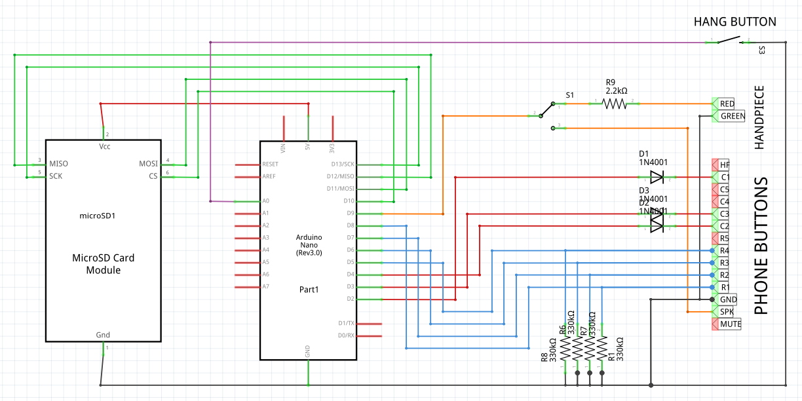
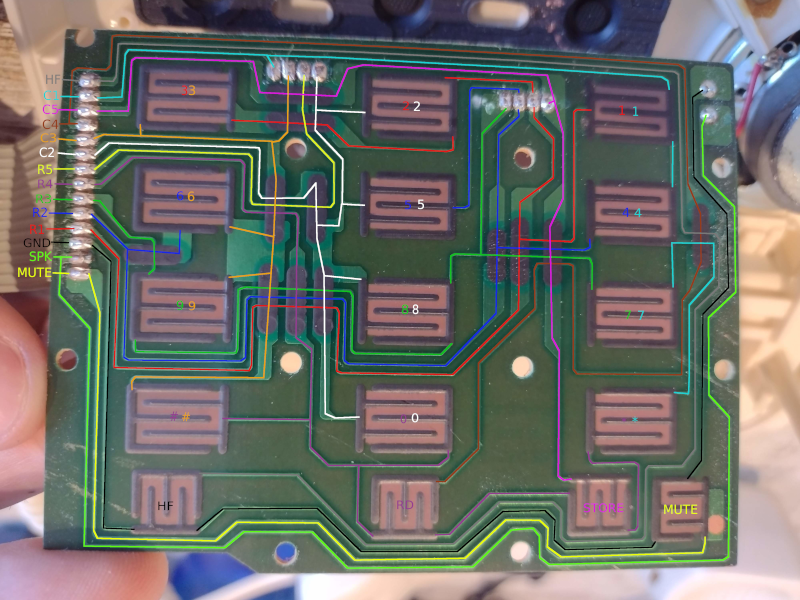

# Phone

Escape room puzzle to dial numbers and get a response from the phone.

[TOC]

## Materials

* 1x Old telephone
* 1x Arduino Nano (rev 3.0)
* 3x IN4007 diodes
* 4x 330kΩ resistors
* 1x 22kΩ resistors
* 1x switch

## Schematic

Initial implementation using the numpad as a piano.

## Hardware details

Numpad circuit tracing.

