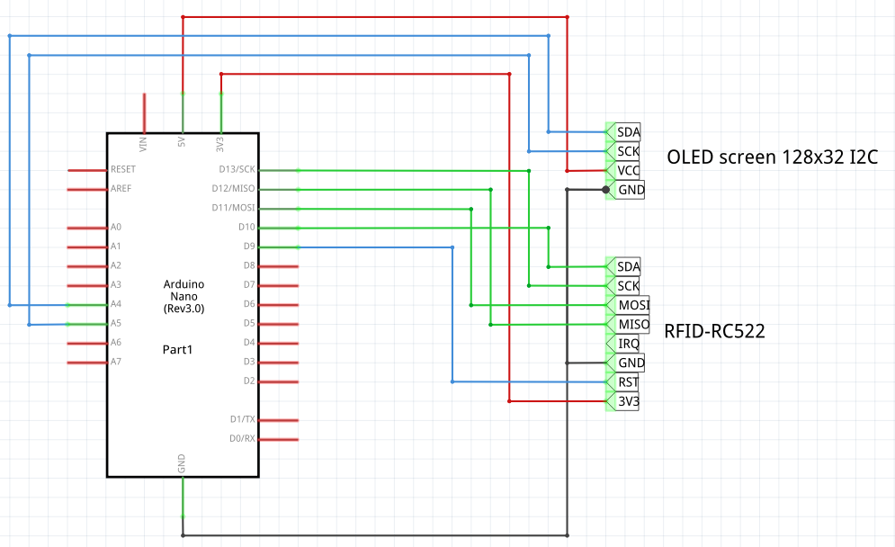

# Phone

Escape room puzzle to scan several RFIDs representing money until enough raised.

[TOC]

## Materials

* 1x Arduino Nano (rev 3.0)
* 1x RFID-RC522
* 1x OLED screen 128x64 I2C

## Schematic

