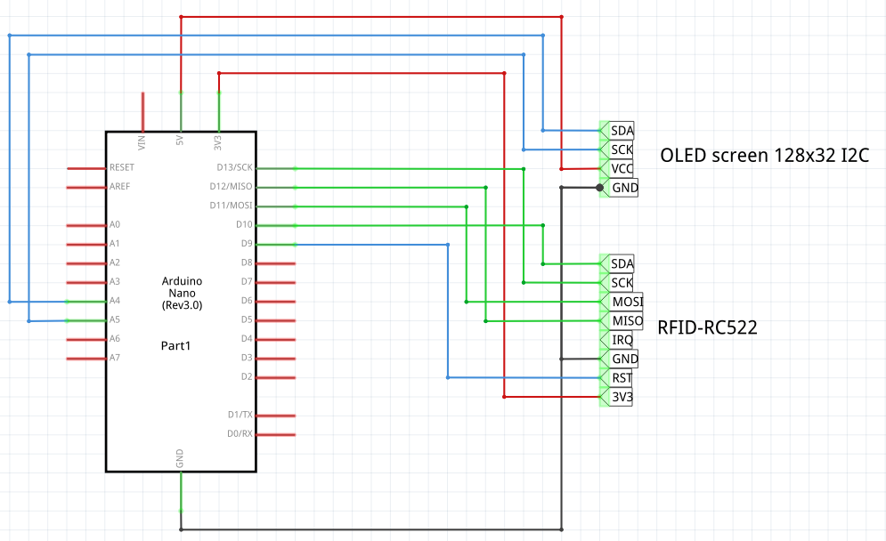

# Phone

Escape room puzzle to scan an RFID to get access, showed in a screen.

[TOC]

## Materials

* 1x Arduino Nano (rev 3.0)
* 1x RFID-RC522
* 1x OLED screen 128x32 I2C

## Schematic



## Prepare images

Convert them to 32px height, grayscale single channel (flatten image) with `Gimp > Colors > Dither` using method `None`.

Once the image is saved, convert to binary image code with:

```bash
cargo run <image.png>
```
